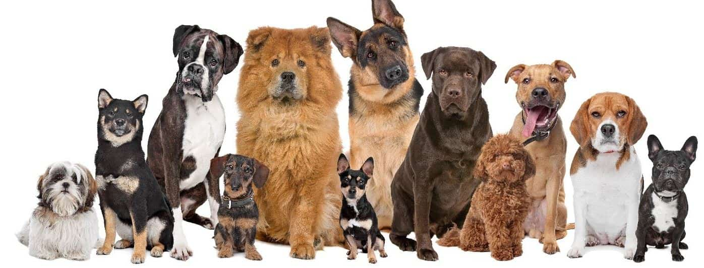

#piplelinedogs

This is the second proyect for Ironhack.
Kaggle data set enriched with data from an API and from wikipedia scrapping. 

The proyect itself has a few different steps:
- Choosing an easy/usefull/interesting API
- Finding a dataset from Kaggle to convine the info. In my case, I take the dog breeds in diffeents neighbourhoods in Chicago.
- Clean the dataset to use the information we need: neighbourhood and breed. 

